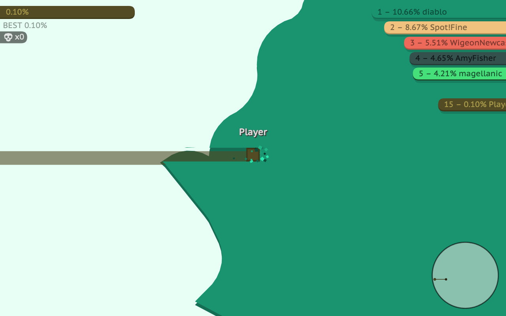

# PaperLand

[](https://github.com/lmssiehdev/paperland/actions/workflows/ci.yml)

An open-source, Paper.io-style territory game: leave your base, draw a trail, close the loop to claim the
land inside it. Don't let anyone cross your trail.



PaperLand started as a faithful reverse-engineering of a Paper.io 2 clone and is now hand-maintained,
strictly typed TypeScript. The simulation runs headless and deterministically, so the same game can run in
the browser, on a server or inside tests.

## Features

- **Classic and Teams modes** against 15 AI bots with their own state machine (capture, return, attack).
- **Headless, deterministic core**: no DOM, no Node/Bun APIs, bit-exact trig, so a seeded game gives the
  same result in Chromium and in Bun.
- **Multiplayer groundwork**: a Bun + Elysia server runs game rooms at 20 Hz and talks to clients over a
  compact binary WebSocket protocol.
- **9 UI languages** (en, ru, tr, es, fr, nl, pt, de, it).
- **Tested against the original**: golden hashes and a parity test check that behavior matches the game
  it was rebuilt from.

## Quick start

Requires [Bun](https://bun.sh).

```sh
bun install
bun run build    # build the browser bundle
bun run serve    # start the server on http://localhost:3000
```

For development, `bun run dev` rebuilds the client and restarts the server on every change (reload the
page to see client changes). Use `PORT=3100 bun run serve` for another port.

## Scripts

| Command | What it does |
|---|---|
| `bun run dev` | Dev bundle + server, both in watch mode |
| `bun run build:dev` | Dev bundle with debug keys, `?seed=` / `?mode=` and `window.paperio2api` |
| `bun run check` | Typecheck, lint, format check and unit tests |
| `bun run test:unit` | Unit tests in Bun: game logic, protocol, server, golden hash (no browser) |
| `bun test` | The above plus the Chromium tests (trig bit-exactness, golden in Chromium) |
| `bun run smoke` | Boots the game in headless Chromium, plays a round, saves screenshots to `shots/` |
| `bun run golden` | Deterministic simulation hash on the real page (must not change on refactors) |
| `bun run parity 6` | Compares 6 seeded games against the original build |
| `bun run autopilot 5 180` | 5 trials of 180 simulated seconds, straight line vs AI autopilot |

The browser scripts (`smoke`, `golden`, `parity`, `autopilot`) use Playwright, need a dev build
(`bun run build:dev`) and a running server. Set `BASE_URL` to point them elsewhere.

CI runs typecheck, lint, format, build and `test:unit` on every push and PR. Run `bun run test:chromium`
and `bun run parity 6` by hand after upgrading Playwright or touching `packages/core/src/engine/trig.ts`.

## PR previews

Add the `preview` label to a pull request to deploy it to Cloudflare Workers at
`https://paperland-pr-<number>.lmssieh.workers.dev` (dev build, so `?mode=teams` and `?seed=` work). New
commits redeploy and update the same comment. Closing or merging the PR, or removing the label, deletes it.
Only PRs from branches of this repo can be previewed (forks get no secrets). `bun run build:site` builds
the same static site locally into `packages/client/dist/site`.

## Project layout

```
packages/
  core/      the game itself, headless: rules, geometry, bots, modes
  protocol/  binary wire format shared by client and server
  client/    browser: Preact UI, canvas renderer, input
  server/    Bun + Elysia: HTTP API, WebSocket rooms
  e2e/       Playwright tests and cross-package checks
```

Dependencies only point one way: `client -> protocol -> core` and `server -> protocol -> core`. A test
enforces it.

## Documentation

- [Architecture](docs/ARCHITECTURE.md): packages, headless seams, determinism, server protocol and the
  reverse-engineering pipeline.
- [Findings](docs/FINDINGS.md): how the original game works, its network behavior and bugs found in it.

## Disclaimer

PaperLand is an independent fan project. It is not affiliated with or endorsed by Voodoo or the makers of
Paper.io. All trademarks belong to their owners.
